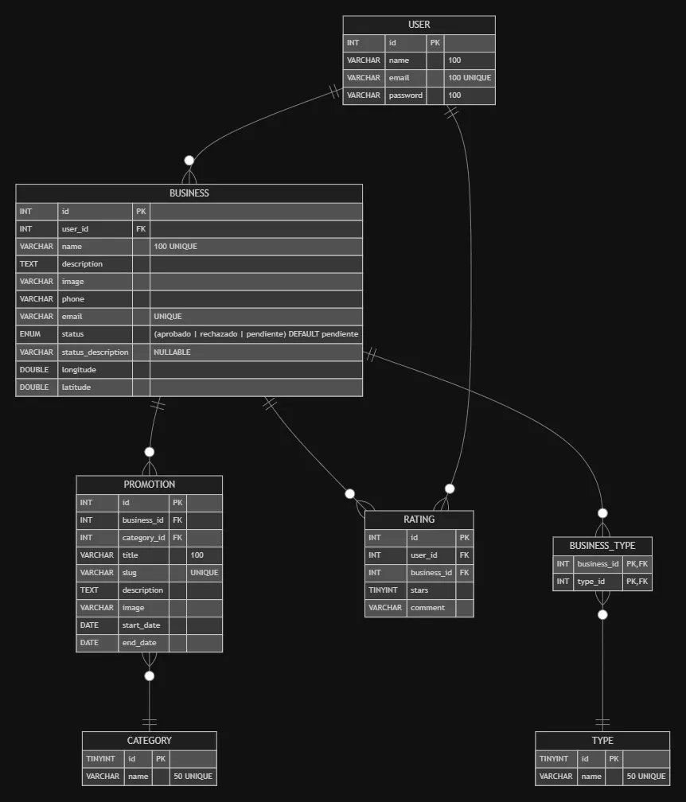

# Documentación de "Promozioni"

## Tabla de Contenidos
1. [Introducción](#1-introducción)
   - [Definiciones y Acrónimos](#definiciones-y-acrónimos)
2. [Descripción General](#2-descripción-general)
   - [Funcionalidades](#funcionalidades)
   - [Tipos de Usuarios](#tipos-de-usuarios)
   - [Restricciones](#restricciones)
3. [Requisitos del Sistema](#3-requisitos-del-sistema)
   - [Requisitos Funcionales](#requisitos-funcionales)
   - [Requisitos No Funcionales](#requisitos-no-funcionales)
4. [Diseño del Sistema](#4-diseño-del-sistema)
   - [Arquitectura](#arquitectura)
   - [Componentes](#componentes)
5. [Base de Datos](#5-base-de-datos)
   - [Modelo Entidad-Relación](#modelo-entidad-relación)
---

## 1. Introducción
Este documento describe los requisitos, arquitectura y diseño de la aplicación web "Promozioni", enfocada en conectar negocios con clientes a través de promociones geolocalizadas.

### Definiciones y Acrónimos
- **Promozioni**: Nombre de la aplicación.
- **Negocio**: Comercio que publica ubicaciones y promociones.
- **Usuario**: Persona que busca promociones.
- **Administrador**: Gestor del sistema.
- **Mapa Interactivo**: Herramienta para visualizar negocios y promociones.

## 2. Descripción General
"Promozioni" permite a negocios publicar promociones y ubicaciones, mientras que los usuarios pueden explorar y aprovechar ofertas cercanas mediante un mapa interactivo.

### Funcionalidades
- **Usuarios**: Registro, autenticación, exploración de promociones, valoración de negocios.
- **Negocios**: Gestión de promociones.
- **Administradores**: Moderación de usuarios, negocios y contenido.

### Tipos de Usuarios
- **Clientes**: Buscan promociones.
- **Negocios**: Publican promociones.
- **Administradores**: Gestionan la plataforma.

### Restricciones
- Solo disponible en web.
- Ámbito geográfico inicial: Colombia.

## 3. Requisitos del Sistema

### Requisitos Funcionales
#### Registro y Autenticación
- Registro con nombre, email y contraseña.
- Inicio de sesión con email y contraseña.

#### Gestión de Negocios
- Creación y edición de negocios.

#### Gestión de Promociones
- Creación, edición y eliminación de promociones con detalles (título, descripción, imagen, fechas).

#### Visualización de Negocios y Promociones
- Mapa interactivo sin autenticación.
- Filtro por categoría.

#### Valoración de Sucursales
- Ver valoraciones sin autenticación.
- Agregar y eliminar valoraciones autenticado.

#### Gestión del Sistema
- Administración de usuarios, negocios, promociones y roles.
- Moderación de contenido.

### Requisitos No Funcionales
- **Rendimiento**: Respuesta rápida y eficiente.
- **Seguridad**: Protección de datos de usuarios y negocios.
- **Usabilidad**: Diseño intuitivo.

## 4. Diseño del Sistema
### Arquitectura
Aplicación monolítica con Laravel (Blade e Inertia Vue), MySQL, Leaflet para mapas y MoonShine para panel administrativo.

### Componentes
- **Frontend**: Vue.js + FlyonUI + Leaflet.
- **Backend**: Laravel.
- **Base de Datos**: MySQL.

## 5. Base de Datos
### Modelo Entidad-Relación

