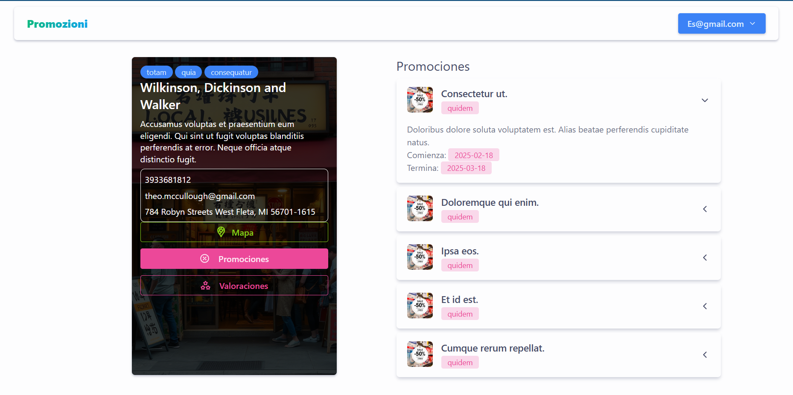
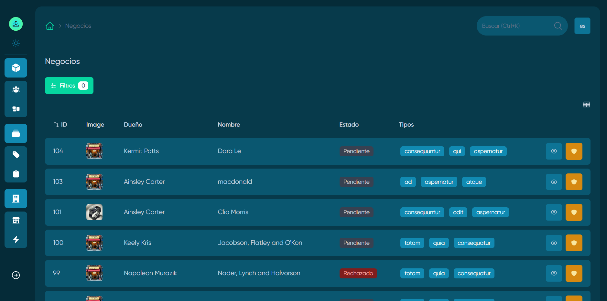

# Promozioni 🌐

[Documentación](./.docs/README.md)

Promozioni es una app web que permite a negocios locales publicar sus ubicaciones y promociones. Los usuarios pueden buscar ofertas cercanas en tiendas, restaurantes y comercios, aprovechando descuentos y promociones actualizadas en tiempo real.

### [video](https://youtu.be/FGabkLGRoGg)


## Usuario
|                                        |
|  |  |
|-------------------------------------|-------------------------------------|
|        ||


## Panel Super Admin
|  |  |
|--------------------------------|--------------------------------|


Package | Version
--- | ---
Laravel | v11
MoonShine  | v3
Inertia | v2

## Instalación
Así es como puedes ejecutar el proyecto localmente:

1. Clona el repositorio
    ```sh
    git clone https://github.com/estivenm0/promozioni.git
    ```

2. Navega al directorio raíz del proyecto
    ```sh
    cd promozioni
    ```

3. Copia el archivo `.env.example` a `.env`
    ```sh
    cp .env.example .env
    ```


4. Instala las dependencias
    ```sh
    composer install
    ```

5. Genera la clave de la aplicación
    ```sh
    php artisan key:generate
    ```

5. Genera enlace de storage
    ```sh
    php artisan storage:link
    ```

6. Ejecuta las migraciones
    ```sh
    php artisan migrate
    ```

7. instala el paquete de permisos
    ```sh
    php artisan moonshine:generate
    ```

8. Ejecuta seeders
    ```sh
    php artisan db:seed
    ```

8. Crea un Usuario super usuario
    ```sh
    php artisan moonshine-rbac:user
    ```
